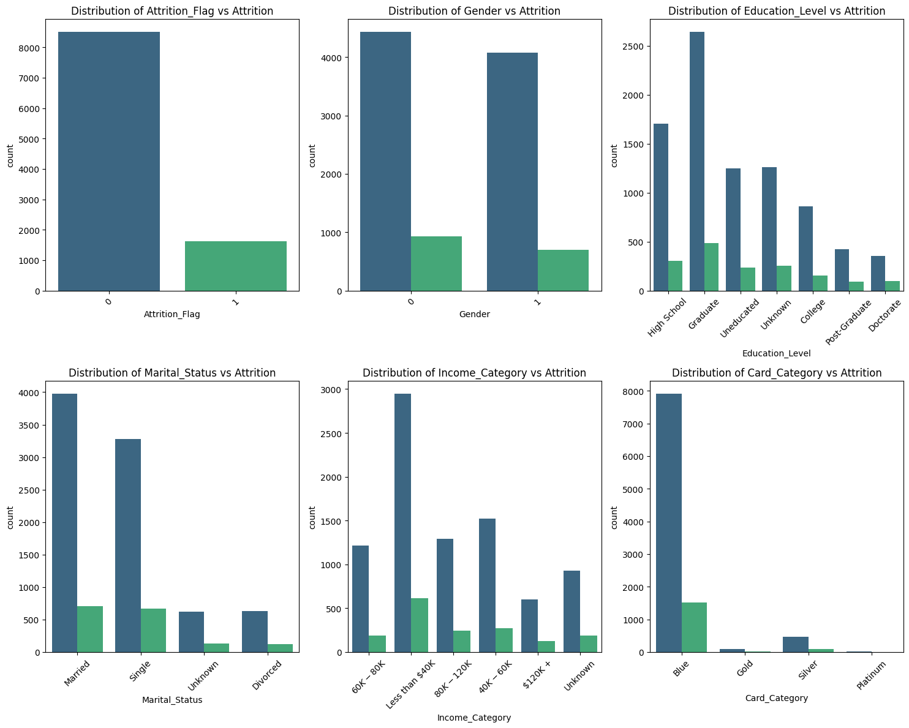
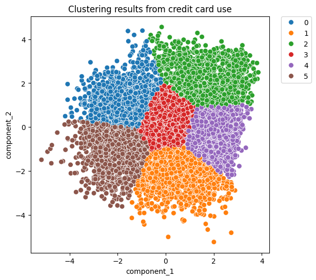
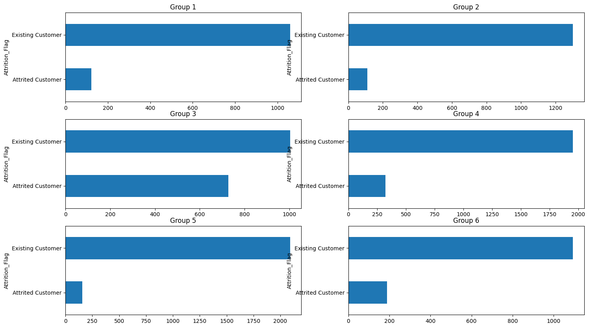
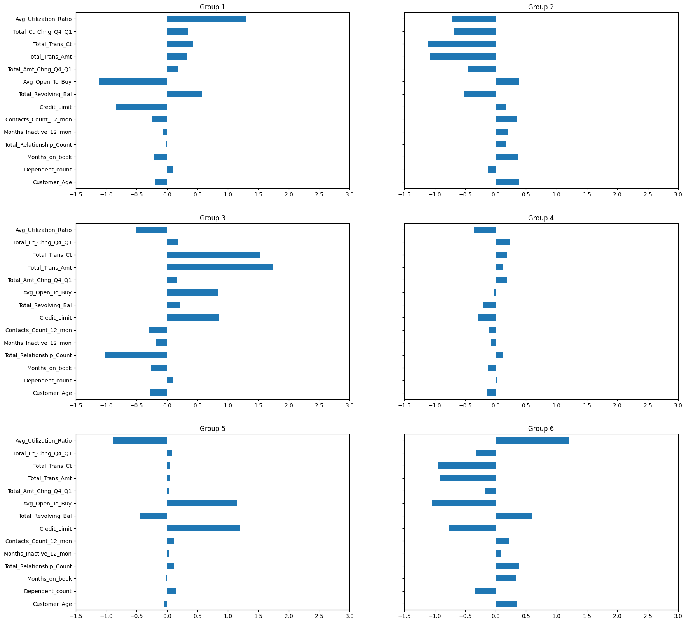

# DA_projects-credit-card-churn


 ## 🏢 Description

This project focuses on predicting customer churn and providing actionable insights into customer behavior and retention strategies for a credit card company. Our team was tasked with analyzing a dataset containing customer demographic, account, and transaction information to uncover patterns and trends related to churn. This analysis explores customer segmentation, churn drivers, and potential strategies for customer retention.

Python: For data manipulation, analysis,machine learning, and visualization.

## Installation
. Required Python version: Python 3.8 or higher.
. Install the required libraries:
    pip install pandas numpy scikit-learn matplotlib seaborn jupyter
. Clone the repository and navigate to the project directory:
    git clone https://github.com/muntadherabdulhusein/DA_projects-credit-card-churn/tree/main
  
## 🛎️ Usage
. Clone the repository to your local machine.
. Set Up Your Environment.Ensure you have the necessary libraries installed. You can do this by running:
    pip install -r requirements.txt
. Open the main.ipynb file in Jupyter Notebook
. For classification analyses and prediction analyses and results click on the classification.ipynb file.
. To see the clustering analyses and the characteristics of customers who have left the bank click on the 
clustering.ipynb file 

 ## Data Sources
 The Kaggle Credit Card Customers Dataset has been used for this project.

 ## 📦 Repo structure
 ```
├── cleaned_data/
│   ├── cleaned_data.csv
│   └── fixed_data.ipynb
├── Maarten/
│   ├── maarten.ipynb
| 
├── Main/
│   |── classifiying.ipynb
|   └── clustering.ipynb
├── Muntadher/
│   └── test.ipynb
|  
├── Yeliz/
│   |── yeliz_classf.ipynb
│   └── yeliz_clus.ipynb
│    
├── Yusra/
│   ├── CC(dataanalysis).ipynb
│   └── Creditcard-kmeans.ipynb
|   
├── BankChurners.csv
└── README.md
```
 ## Visuals

 ### Churn Insights
  

 ### Model Performance

 ### Clustering





 ## Conclusion
This project demonstrates how machine learning can provide actionable insights into customer behavior and help businesses reduce churn. By combining classification and clustering techniques, we successfully predicted churn and identified meaningful customer segments, paving the way for targeted and efficient retention strategies.

 ## ⏱️ Timeline
This project took five days for completion.

 ## 📌 Contributors
This project was done as part of the AI Boocamp at BeCode.org.
```
Muntadher Abdulhusein 
Yusra Ali
Yeliz Kaya
Maarten Warnez
```